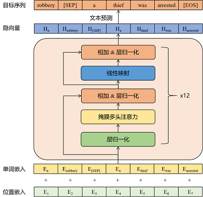

# GPT2 for Chinese chitchat

# 添加了本地网页demo，运行app.py

### [Blog](https://ppphhhleo.github.io/2022/12/20/bot/)

#### Cooperate with ***Three Baos***

## 项目描述

-   项目基于GPT2的中文闲聊机器人，模型实现基于HuggingFace的transformers。

-   本项目受 [GPT2-Chinese](https://github.com/Morizeyao/GPT2-Chinese)启发

-   在生成阶段，使用了Temperature、Top-k Sampling和Nucleus
    Sampling等，可参考论文The Curious Case of Neural Text Degeneration

## 运行环境

python3.6、 transformers==4.2.0、pytorch==1.7.0 Flask\>=0.11 chatterbot\>=0.7.1

## 项目结构

-   data

    -   train.txt:默认的原始训练集文件，存放闲聊语料

        -   train.pkl:对原始训练语料进行tokenize之后的文件,存储一个list对象，list的每条数据表示一个多轮对话，表示一条训练数据

-   model:存放对话生成的模型

    -   epoch40:经过40轮训练之后得到的模型

        -   config.json:模型参数的配置文件

            -   pytorch_model.bin:模型文件

-   vocab

    -   vocab.txt:字典文件。默认的字典大小为13317，若需要使用自定义字典，需要将confog.json文件中的vocab_size字段设为相应的大小。

-   sample:存放人机闲聊生成的历史聊天记录

-   train.py:训练代码

-   interact.py:人机交互代码

-   preprocess.py:数据预处理代码

-   app.py: 网页demo

-   templates：网页demo前端模板

预处理数据集：放入/data，[Google Drive train.pkl 下载](https://drive.google.com/file/d/1ywa2AC3MYTyBRVMakRvbDb4QDuVG0iIp/view?usp=sharing)

原始数据集：[Google Drive train.txt 下载](https://drive.google.com/file/d/1MffA8QTINXsvfuLKkrPvT0lTu6dLfeiy/view?usp=sharing)

训练模型：文件夹放入/model [Google Drive model 下载](https://drive.google.com/drive/folders/16vUse9qYPVXw501EDSRBNTG47v8H1Xdw?usp=sharing)

## 模型简介

### 模型结构

### 模型参数简介(详见模型的config.json文件)

-   initializer_range: 0.02

-   layer_norm_epsilon: 1e-05

-   n_ctx: 1024

-   n_embd: 768

-   n_head: 12

-   n_layer: 12

-   n_positions: 1024

-   vocab_size: 21128

## 训练思路

对每条训练数据进行拼接，然后将其输入到模型中，进行训练。

对于如下多轮闲聊训练数据,在训练模型时，将训练数据进行如下拼接:"[CLS]想看你的美照[SEP]亲我一口就给你看[SEP]我亲两口[SEP]讨厌人家拿小拳拳捶你胸口[SEP]"。然后将上述拼接结果作为模型的输入，让模型进行自回归训练。

~~~~~~~~~~~~~~~~~~~~~~~~~~~~~~~~~~~~~~~~~~~~~~~~~~~~~~~~~~~~~~~~~~~~~~~~~~~~~~~~
想看你的美照
亲我一口就给你看
我亲两口
讨厌人家拿小拳拳捶你胸口
~~~~~~~~~~~~~~~~~~~~~~~~~~~~~~~~~~~~~~~~~~~~~~~~~~~~~~~~~~~~~~~~~~~~~~~~~~~~~~~~

## 使用方法

### Quick Start

在模型分享中下载模型，将模型文件夹model_epoch40_50w放到model目录下，执行如下命令，进行对话

~~~~~~~~~~~~~~~~~~~~~~~~~~~~~~~~~~~~~~~~~~~~~~~~~~~~~~~~~~~~~~~~~~~~~~~~~~~~~~~~
python interact.py --no_cuda --model_path model_epoch40_50w (使用cpu生成，速度相对较慢)
或
python interact.py --model_path model_epoch40_50w --device 0 (指定0号GPU进行生成，速度相对较快)
~~~~~~~~~~~~~~~~~~~~~~~~~~~~~~~~~~~~~~~~~~~~~~~~~~~~~~~~~~~~~~~~~~~~~~~~~~~~~~~~

### 数据预处理

在项目根目录下创建data文件夹，将原始训练语料命名为train.txt，存放在该目录下。train.txt的格式如下，每段闲聊之间间隔一行，格式如下：

~~~~~~~~~~~~~~~~~~~~~~~~~~~~~~~~~~~~~~~~~~~~~~~~~~~~~~~~~~~~~~~~~~~~~~~~~~~~~~~~
真想找你一起去看电影
突然很想你
我也很想你

想看你的美照
亲我一口就给你看
我亲两口
讨厌人家拿小拳拳捶你胸口
~~~~~~~~~~~~~~~~~~~~~~~~~~~~~~~~~~~~~~~~~~~~~~~~~~~~~~~~~~~~~~~~~~~~~~~~~~~~~~~~

运行preprocess.py，对data/train.txt对话语料进行tokenize，然后进行序列化保存到data/train.pkl。train.pkl中序列化的对象的类型为List[List],记录对话列表中,每个对话包含的token。

~~~~~~~~~~~~~~~~~~~~~~~~~~~~~~~~~~~~~~~~~~~~~~~~~~~~~~~~~~~~~~~~~~~~~~~~~~~~~~~~
python preprocess.py --train_path data/train.txt --save_path data/train.pkl
~~~~~~~~~~~~~~~~~~~~~~~~~~~~~~~~~~~~~~~~~~~~~~~~~~~~~~~~~~~~~~~~~~~~~~~~~~~~~~~~

### 训练模型

运行train.py,使用预处理后的数据，对模型进行自回归训练，模型保存在根目录下的model文件夹中。**模型命名为：pytorch_model.bin，同文件夹下，需有配置文件config.json**

在训练时，可以通过指定patience参数进行early
stop。当patience=n时，若连续n个epoch，模型在验证集上的loss均没有下降，则进行early
stop，停止训练。当patience=0时，不进行early stop。

代码中默认关闭了early stop，因为在实践中，early
stop得到的模型的生成效果不一定会更好。

~~~~~~~~~~~~~~~~~~~~~~~~~~~~~~~~~~~~~~~~~~~~~~~~~~~~~~~~~~~~~~~~~~~~~~~~~~~~~~~~
python train.py --epochs 40 --batch_size 8 --device 0,1 --train_path data/train.pkl
~~~~~~~~~~~~~~~~~~~~~~~~~~~~~~~~~~~~~~~~~~~~~~~~~~~~~~~~~~~~~~~~~~~~~~~~~~~~~~~~

更多的训练参数介绍，可直接看train.py中的set_args()函数中的参数说明

### 人机交互

运行interact.py，使用训练好的模型，进行人机交互，输入Ctrl+Z结束对话之后，聊天记录将保存到sample目录下的sample.txt文件中。

~~~~~~~~~~~~~~~~~~~~~~~~~~~~~~~~~~~~~~~~~~~~~~~~~~~~~~~~~~~~~~~~~~~~~~~~~~~~~~~~
python interact.py --no_cuda --model_path path_to_your_model --max_history_len 3(由于闲聊对话生成的内容长度不是很长，因此生成部分在CPU上跑速度也挺快的)
~~~~~~~~~~~~~~~~~~~~~~~~~~~~~~~~~~~~~~~~~~~~~~~~~~~~~~~~~~~~~~~~~~~~~~~~~~~~~~~~

执行interact.py时，可以尝试通过调整topk、topp、repetition_penalty、max_history_len等参数，调整生成的效果。更多的参数介绍，可直接看interact.py的set_args()函数中的参数说明
如果要使用GPU进行生成，则不要调用--no_cuda参数，并且通过--device
gpu_id来指定使用哪块GPU。

## Reference

-   [The Curious Case of Neural Text
    Degeneration](https://arxiv.xilesou.top/pdf/1904.09751.pdf)

-   [transformers](https://github.com/huggingface/transformers)

-   [GPT2-Chinese](https://github.com/Morizeyao/GPT2-Chinese)

-   [DialoGPT:Large-Scale Generative Pre-training for Conversational Response
    Generation](https://arxiv.xilesou.top/pdf/1911.00536.pdf)

-   <https://github.com/yangjianxin1/GPT2-chitchat>
